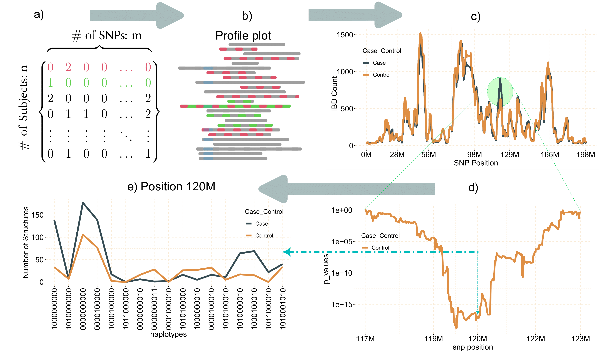
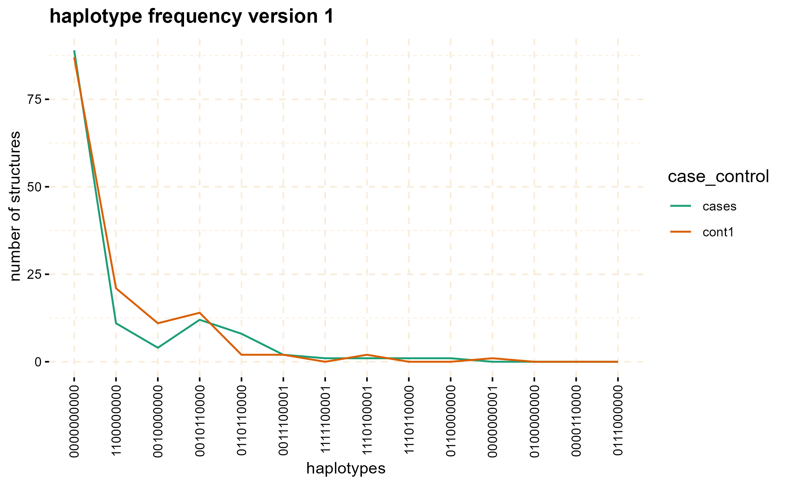

<!-- README.md is generated from README.Rmd. Please edit that file -->

```{r, include = FALSE}
knitr::opts_chunk$set(
  collapse = TRUE,
  comment = "#>",
  fig.path = "man/figures/README-",
  out.width = "100%"
)
```

# gwid 

<!-- badges: start -->
[](https://github.com/soroushmdg/gwid/actions/workflows/R-CMD-check.yaml)
<!-- badges: end -->

GWID (Genome Wide Identity by Descent) is an R-package designed for the analysis of IBD (Identity by Descent) data, to discover rare alleles (susceptibility regions) associated with case-control phenotype. Although Genome Wide Association Studies (GWAS) successfully reveal numerous common variants linked to diseases, they exhibit lack of power to identify rare alleles. To address this limitation, we have developed a pipeline that employs IBD data (output of refined-IBD software). This methodology encompasses a sequential process for analyzing the aforementioned data within isolated populations. The primary objective of this approach is to enhance the sensitivity of variant detection by utilizing information from genetically related individuals, thereby facilitating the identification of causal variants. An overall representation of the pipeline is visually depicted in the following figure.


```{r, out.width="100%",include=TRUE, fig.align="center", fig.cap=c("gwid pipeline"), echo=FALSE}

``` 
## Usage

The `gwid` package receives four types of inputs: a genotype file, an IBD file, a haplotype file, and  phenotype file. The genotype data is derived from the output of the [SNPRelate](https://www.bioconductor.org/packages/release/bioc/html/SNPRelate.html) package in the form of a **gds** file. The IBD file takes the form of tabulated data produced by the [Refined IBD](https://faculty.washington.edu/browning/refined-ibd.html) software. Haplotype file comes from the output of the [Beagle](http://faculty.washington.edu/browning/beagle/beagle.html), while phenotype data is represented using an R list.

## Installation

You can install the development version of `gwid` from [GitHub](https://github.com/) with:

``` r
# install.packages("devtools")
devtools::install_github("soroushmdg/gwid")
```

## Example

We demonstrated the key functionalities of gwid using the rheumatoid arthritis (RA) GWAS dataset. This dataset consisted of DNA samples collected from 478 individuals diagnosed with rheumatoid arthritis (RA) and a control
group of 1,434 individuals without RA. Genotyping was performed using the Illumina Infinium array. All samples were
obtained from a genetically homogeneous population in central Wisconsin exhibiting elevated relatedness structure. Because size of data is large, we use `pggyback` package to upload and download data from github repository. 
```{r}
# install.packages("piggyback")
piggyback::pb_download(repo = "soroushmdg/gwid",
            tag = "v0.0.1",
            dest = tempdir())
ibd_data_file <- paste0(tempdir(),"//chr3.ibd")
genome_data_file <- paste0(tempdir(),"//chr3.gds")
phase_data_file <- paste0(tempdir(),"//chr3.vcf")
case_control_data_file <- paste0(tempdir(),"//case-cont-RA.withmap.Rda")
```
### Input
In this code we explain each input data files individually. `case_control` is object of class `caco` that has phenotype information.  `snp_data_gds` object of class `gwas` read output of `SNPRelate` package, we use this package because it is very fast and efficient. `haplotype_data` object of class `phase` has haplotype data. `ibd_data` is an object of `gwid` class that has IBD information.  

```{r example}
library(gwid)

# case-control data
case_control <- gwid::case_control(case_control_rda = case_control_data_file)
names(case_control) #cases and controls group
summary(case_control) # in here, we only consider cases,cont1,cont2,cont3 groups in the study
case_control$cases[1:3] # first three subject names of cases group

# read SNP data (use SNPRelate to convert it to gds) and count number of minor alleles  
snp_data_gds <- gwid::build_gwas(gds_data = genome_data_file,caco = case_control,gwas_generator = TRUE)
class(snp_data_gds)
names(snp_data_gds)
head(snp_data_gds$snps) # it has information about counts of minor alleles in each location.

# read haplotype data (output of beagle)
haplotype_data <- gwid::build_phase(phased_vcf = phase_data_file,caco = case_control)
class(haplotype_data)
names(haplotype_data)
dim(haplotype_data$Hap.1) #22302 SNP and 1911 subjects

# read IBD data (output of Refined-IBD)
ibd_data <- gwid::build_gwid(ibd_data = ibd_data_file,gwas = snp_data_gds)
class(ibd_data)
ibd_data$ibd # refined IBD output
ibd_data$res # count number of IBD for each SNP location 

```


### `plot` method

The `plot` function can be applied to the `gwid` class to display the counts of IBD in each Single SNP among both case and control groups. By utilizing the `ly=TRUE` parameter, the user has the option to transform the plot into a `plotly` object, facilitating interactive exploration of the entire chromosome or specific regions of interest through the use of `snp_start` and `snp_end` parameters. Additionally, the `y` parameter enables the inclusion of only specific groups of subjects for consideration.


```{r}
# plot count of IBD in chromosome 3
plot(ibd_data,y = c("cases","cont1"),ly = FALSE) 

# Further investigate location between 117M and 122M
# significant number of IBD's in group cases, compare to cont1, cont2 and cont3.
plot(ibd_data,y = c("cases","cont1"),snp_start = 117026294,snp_end = 122613594,ly = FALSE) 

```

Through the utilization of the `fisher_test` method, it becomes possible to calculate p-values within chosen regions. These p-values help assess whether there are noteworthy differences in counts between the case and control groups.

```{r}
model_fisher <- gwid::fisher_test(ibd_data,case_control,reference = "cases",
                                             snp_start = 117026294,snp_end = 122613594)

class(model_fisher)

plot(model_fisher, y = c("cases","cont1"),ly = FALSE)
```

The `haplotype_structure` method can be utilized to extract haplotypes from regions that exhibit IBD patterns in a sliding window manner. `w` is length of sliding window and 

```{r}
hap_str <- gwid::haplotype_structure(ibd_data,
                                     phase = haplotype_data,
                                     w = 10,
                                     snp_start = 117026294,snp_end = 122613594)
class(hap_str)

hap_str[sample(1:nrow(hap_str),size = 5),] # structures column have haplotype of length w=10 
```
The `haplotype_frequency` method can be employed to extract the count of these structures, which can then be plotted for each window.

```{r}
haplo_freq <- gwid::haplotype_frequency(hap_str)
```
```{r, eval=FALSE}

# plot haplotype counts in first window (nwin=1).
 plot(haplo_freq,
   y = c("cases", "cont1"),
   plot_type = "haplotype_structure_frequency",
   nwin = 1, type = "version1",
   ly = FALSE
 )

```

```{r, out.width="100%",include=TRUE, fig.align="center", echo=FALSE}

``` 

