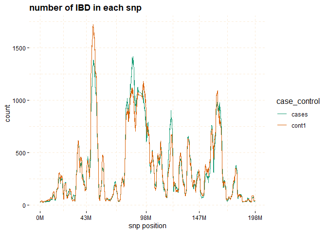
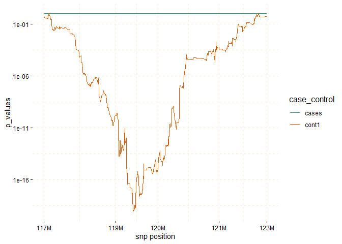

<!-- README.md is generated from README.Rmd. Please edit that file -->

# gwid

<!-- badges: start -->

[](https://github.com/soroushmdg/gwid/actions/workflows/R-CMD-check.yaml)
<!-- badges: end -->

GWID (Genome Wide Identity by Descent) is an R-package designed for the
analysis of IBD (Identity by Descent) data, to discover rare alleles
(susceptibility regions) associated with case-control phenotype.
Although Genome Wide Association Studies (GWAS) successfully reveal
numerous common variants linked to diseases, they exhibit lack of power
to identify rare alleles. To address this limitation, we have developed
a pipeline that employs IBD data (output of refined-IBD software). This
methodology encompasses a sequential process for analyzing the
aforementioned data within isolated populations. The primary objective
of this approach is to enhance the sensitivity of variant detection by
utilizing information from genetically related individuals, thereby
facilitating the identification of causal variants. An overall
representation of the pipeline is visually depicted in the following
figure.

<div class="figure" style="text-align: center">


<p class="caption">
gwid pipeline
</p>

</div>

## Usage

The `gwid` package receives four types of inputs: a genotype file, an
IBD file, a haplotype file, and phenotype file. The genotype data is
derived from the output of the
[SNPRelate](https://www.bioconductor.org/packages/release/bioc/html/SNPRelate.html)
package in the form of a **gds** file. The IBD file takes the form of
tabulated data produced by the [Refined
IBD](https://faculty.washington.edu/browning/refined-ibd.html) software.
Haplotype file comes from the output of the
[Beagle](http://faculty.washington.edu/browning/beagle/beagle.html),
while phenotype data is represented using an R list.

## Installation

You can install the development version of `gwid` from
[GitHub](https://github.com/) with:

``` r
# install.packages("devtools")
devtools::install_github("soroushmdg/gwid")
```

## Example

We demonstrated the key functionalities of gwid using the rheumatoid
arthritis (RA) GWAS dataset. This dataset consisted of DNA samples
collected from 478 individuals diagnosed with rheumatoid arthritis (RA)
and a control group of 1,434 individuals without RA. Genotyping was
performed using the Illumina Infinium array. All samples were obtained
from a genetically homogeneous population in central Wisconsin
exhibiting elevated relatedness structure. Because size of data is
large, we use `pggyback` package to upload and download data from github
repository.

``` r
# install.packages("piggyback")
library(piggyback)
pb_download(repo = "soroushmdg/gwid",
            tag = "v0.0.1",
            dest = tempdir())
ibd_data_file <- paste0(tempdir(),"//chr3.ibd")
genome_data_file <- paste0(tempdir(),"//chr3.gds")
phase_data_file <- paste0(tempdir(),"//chr3.vcf")
case_control_data_file <- paste0(tempdir(),"//case-cont-RA.withmap.Rda")
```

### Input

In this code we explain each input data files individually.
`case_control` is object of class `caco` that has phenotype information.
`snp_data_gds` object of class `gwas` read output of `SNPRelate`
package, we use this package because it is very fast and efficient.
`haplotype_data` object of class `phase` has haplotype data. `ibd_data`
is an object of `gwid` class that has IBD information.

``` r
library(gwid)
#> 
#> Attaching package: 'gwid'
#> The following objects are masked from 'package:base':
#> 
#>     print, subset

# case-control data
case_control <- gwid::case_control(case_control_rda = case_control_data_file)
names(case_control) #cases and controls group
#> [1] "cases" "case1" "case2" "cont1" "cont2" "cont3"
summary(case_control) # in here, we only consider cases,cont1,cont2,cont3 groups in the study
#>       Length Class  Mode     
#> cases 478    -none- character
#> case1 178    -none- character
#> case2 300    -none- character
#> cont1 477    -none- character
#> cont2 478    -none- character
#> cont3 478    -none- character
case_control$cases[1:3] # first three subject names of cases group
#> [1] "MC.154405@1075678440" "MC.154595@1075642175" "MC.154701@1076254706"

# read SNP data (use SNPRelate to convert it to gds) and count number of minor alleles  
snp_data_gds <- gwid::build_gwas(gds_data = genome_data_file,caco = case_control,gwas_generator = TRUE)
class(snp_data_gds)
#> [1] "gwas"
names(snp_data_gds)
#> [1] "smp.id"   "snp.id"   "snp.pos"  "smp.indx" "smp.snp"  "caco"     "snps"
head(snp_data_gds$snps) # it has information about counts of minor alleles in each location.
#>    snp_pos case_control value
#> 1:   66894        cases   627
#> 2:   66894        case1   240
#> 3:   66894        case2   387
#> 4:   66894        cont1   639
#> 5:   66894        cont2   647
#> 6:   66894        cont3   646

# read haplotype data (output of beagle)
haplotype_data <- gwid::build_phase(phased_vcf = phase_data_file,caco = case_control)
class(haplotype_data)
#> [1] "phase"
names(haplotype_data)
#> [1] "Hap.1" "Hap.2"
dim(haplotype_data$Hap.1) #22302 SNP and 1911 subjects
#> [1] 22302  1911

# read IBD data (output of Refined-IBD)
ibd_data <- gwid::build_gwid(ibd_data = ibd_data_file,gwas = snp_data_gds)
class(ibd_data)
#> [1] "gwid"
ibd_data$ibd # refined IBD output
#>                              V1 V2                      V3 V4 V5        V6
#>      1: MC.AMD127769@0123889787  2    MC.160821@1075679055  1  3  32933295
#>      2: MC.AMD127769@0123889787  1 MC.AMD107154@0123908746  1  3  29995340
#>      3: MC.AMD127769@0123889787  2    9474283-1-0238040187  1  3  34165785
#>      4: MC.AMD127769@0123889787  1    MC.159487@1075679208  2  3  21526766
#>      5:    MC.163045@1082086165  2    MC.160470@1075679095  1  3  11822616
#>     ---                                                                   
#> 377560:    1492602-1-0238095971  2    2235472-1-0238095471  2  3 194785443
#> 377561:    4618455-1-0238095900  2    3848034-1-0238094219  1  3 190235788
#> 377562:    MC.160332@1075641581  2    9630188-1-0238038787  2  3 184005719
#> 377563: MC.AMD122238@0124011436  2    MC.159900@1076254946  1  3 181482803
#> 377564: MC.AMD105910@0123907456  1    7542312-1-0238039298  1  3 182440135
#>                V7   V8    V9
#>      1:  34817627 3.26 1.884
#>      2:  31752607 4.35 1.757
#>      3:  35898774 6.36 1.733
#>      4:  23162240 8.71 1.635
#>      5:  13523010 5.29 1.700
#>     ---                     
#> 377560: 196328849 4.92 1.543
#> 377561: 192423862 7.77 2.188
#> 377562: 186184328 5.95 2.179
#> 377563: 184801115 3.58 3.318
#> 377564: 183972729 3.03 1.533
ibd_data$res # count number of IBD for each SNP location 
#>           snp_pos case_control value
#>      1:     66894        cases    27
#>      2:     82010        cases    28
#>      3:     89511        cases    29
#>      4:    104972        cases    29
#>      5:    107776        cases    29
#>     ---                             
#> 133808: 197687252        cont3    44
#> 133809: 197701913        cont3    44
#> 133810: 197744198        cont3    44
#> 133811: 197762623        cont3    44
#> 133812: 197833758        cont3    44
```

### `plot` method

The `plot` function can be applied to the `gwid` class to display the
counts of IBD in each Single SNP among both case and control groups. By
utilizing the `ly=TRUE` parameter, the user has the option to transform
the plot into a `plotly` object, facilitating interactive exploration of
the entire chromosome or specific regions of interest through the use of
`snp_start` and `snp_end` parameters. Additionally, the `y` parameter
enables the inclusion of only specific groups of subjects for
consideration.

``` r
# plot count of IBD in chromosome 3
plot(ibd_data,y = c("cases","cont1"),ly = FALSE) 
```



``` r

# Further investigate location between 117M and 122M
# significant number of IBD's in group cases, compare to cont1, cont2 and cont3.
plot(ibd_data,y = c("cases","cont1"),snp_start = 117026294,snp_end = 122613594,ly = FALSE) 
```


Through the utilization of the `fisher_test` method, it becomes possible
to calculate p-values within chosen regions. These p-values help assess
whether there are noteworthy differences in counts between the case and
control groups.

``` r
model_fisher <- gwid::fisher_test(ibd_data,case_control,reference = "cases",
                                             snp_start = 117026294,snp_end = 122613594)

class(model_fisher)
#> [1] "test_snps"  "data.table" "data.frame"

plot(model_fisher, y = c("cases","cont1"),ly = FALSE)
```



The `haplotype_structure` method can be utilized to extract haplotypes
from regions that exhibit IBD patterns in a sliding window manner. `w`
is length of sliding window and

``` r
hap_str <- gwid::haplotype_structure(ibd_data,
                                     phase = haplotype_data,
                                     w = 10,
                                     snp_start = 117026294,snp_end = 122613594)
class(hap_str)
#> [1] "haplotype_structure" "data.table"          "data.frame"

hap_str[sample(1:nrow(hap_str),size = 5),] # structures column have haplotype of length w=10 
#>    case_control   snp_pos window_number                     smp structures
#> 1:        cont3 121660488           607    MC.157524@0123948124 0000000010
#> 2:        cont3 119946098           391    MC.159487@1075679208 0000000000
#> 3:        cases 121009772           476    8194961-1-0238039486 0000000000
#> 4:        cont3 120976051           474 MC.AMD103829@0123910556 1000000000
#> 5:        cases 118091164           110 MC.AMD110785@0123861281 1000000001
```

The `haplotype_frequency` method can be employed to extract the count of
these structures, which can then be plotted for each window.

``` r
haplo_freq <- gwid::haplotype_frequency(hap_str)
```

``` r

# plot haplotype counts in first window (nwin=1).
 plot(haplo_freq,
   y = c("cases", "cont1"),
   plot_type = "haplotype_structure_frequency",
   nwin = 1, type = "version1",
   ly = FALSE
 )
```


