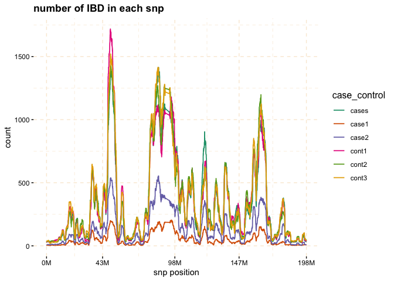

<!-- README.md is generated from README.Rmd. Please edit that file -->

# gwid

<!-- badges: start -->
<!-- badges: end -->

GWID (Genome Wide Identity by Descent) is an R-package designed for the
analysis of IBD (Identity by Descent) data, to discover rare alleles
associated with case-control phenotype. Although Genome Wide Association
Studies (GWAS) successfully reveal numerous common variants linked to
diseases, they exhibit lack of power to identify rare alleles. To
address this limitation, we have developed a pipeline that employs IBD
data (output of refined-IBD software). This methodology encompasses a
sequential process for analyzing the aforementioned data within isolated
populations. The primary objective of this approach is to enhance the
sensitivity of variant detection by utilizing information from
genetically related individuals, thereby facilitating the identification
of causal variants. An overall representation of the pipeline is
visually depicted in the following figure.

<div class="figure" style="text-align: center">


<p class="caption">
gwid pipeline
</p>

</div>

## Usage

The `gwid` package receives four types of inputs: SNP panel information,
IBD information, haplotype data, and data concerning subjects
categorized as cases and controls. The SNP panel data is derived from
the output of the
[SNPRelate](https://www.bioconductor.org/packages/release/bioc/html/SNPRelate.html)
package in the form of a **gds** file. The IBD data takes the form of
tabulated data produced by the [Refined
IBD](https://faculty.washington.edu/browning/refined-ibd.html) software.
Haplotype data comes from the output of the
[Beagle](http://faculty.washington.edu/browning/beagle/beagle.html),
while information about case and control subjects is represented using
an R list.

## Installation

You can install the development version of `gwid` from
[GitHub](https://github.com/) with:

``` r
# install.packages("devtools")
devtools::install_github("soroushmdg/gwid")
```

## Example

The following example is for a SNP panel data from the Marshfield
Clinic. subjects in case group has Rheumatoid Arthritis (RA).

This is a basic example which shows you how to solve a common problem:

``` r
library(gwid)
#> 
#> Attaching package: 'gwid'
#> The following objects are masked from 'package:base':
#> 
#>     print, subset

# case-control data
caco <- gwid::case_control(case_control_rda = case_control_data)
names(caco) #cases and controls group
#> [1] "cases" "case1" "case2" "cont1" "cont2" "cont3"
summary(caco) # in here, we only consider cases,cont1,cont2,cont3 groups in the study
#>       Length Class  Mode     
#> cases 478    -none- character
#> case1 178    -none- character
#> case2 300    -none- character
#> cont1 477    -none- character
#> cont2 478    -none- character
#> cont3 478    -none- character

# read SNP data (use SNPRelate to convert it to gds) and count number of minor alleles  
pieces <- gwid::build_gwas(gds_data = genome_data,caco = caco,gwas_generator = TRUE)
head(pieces$snps)
#>    snp_pos case_control value
#> 1:   66894        cases   627
#> 2:   66894        case1   240
#> 3:   66894        case2   387
#> 4:   66894        cont1   639
#> 5:   66894        cont2   647
#> 6:   66894        cont3   646

# read haplotype data (output of beagle)
myphase <- gwid::build_phase(phased_vcf = phase_data,caco = caco)
names(myphase)
#> [1] "Hap.1" "Hap.2"

# read ibd data (output of refined ibd)
myregion2 <- gwid::build_gwid(ibd_data = ibd_data,gwas = pieces)
myregion2$ibd
#>                              V1 V2                      V3 V4 V5        V6
#>      1: MC.AMD127769@0123889787  2    MC.160821@1075679055  1  3  32933295
#>      2: MC.AMD127769@0123889787  1 MC.AMD107154@0123908746  1  3  29995340
#>      3: MC.AMD127769@0123889787  2    9474283-1-0238040187  1  3  34165785
#>      4: MC.AMD127769@0123889787  1    MC.159487@1075679208  2  3  21526766
#>      5:    MC.163045@1082086165  2    MC.160470@1075679095  1  3  11822616
#>     ---                                                                   
#> 377560:    1492602-1-0238095971  2    2235472-1-0238095471  2  3 194785443
#> 377561:    4618455-1-0238095900  2    3848034-1-0238094219  1  3 190235788
#> 377562:    MC.160332@1075641581  2    9630188-1-0238038787  2  3 184005719
#> 377563: MC.AMD122238@0124011436  2    MC.159900@1076254946  1  3 181482803
#> 377564: MC.AMD105910@0123907456  1    7542312-1-0238039298  1  3 182440135
#>                V7   V8    V9
#>      1:  34817627 3.26 1.884
#>      2:  31752607 4.35 1.757
#>      3:  35898774 6.36 1.733
#>      4:  23162240 8.71 1.635
#>      5:  13523010 5.29 1.700
#>     ---                     
#> 377560: 196328849 4.92 1.543
#> 377561: 192423862 7.77 2.188
#> 377562: 186184328 5.95 2.179
#> 377563: 184801115 3.58 3.318
#> 377564: 183972729 3.03 1.533
myregion2$res # count number of ibd for each SNP location 
#>           snp_pos case_control value
#>      1:     66894        cases    27
#>      2:     82010        cases    28
#>      3:     89511        cases    29
#>      4:    104972        cases    29
#>      5:    107776        cases    29
#>     ---                             
#> 133808: 197687252        cont3    44
#> 133809: 197701913        cont3    44
#> 133810: 197744198        cont3    44
#> 133811: 197762623        cont3    44
#> 133812: 197833758        cont3    44

# plot count of IBD in chromosome 3
plot(myregion2,y = c("cases","cont1"),ly = FALSE) 
```



``` r

# Further investigate location between 117M and 122M
# significant number of IBD's in group cases, compare to cont1, cont2 and cont3.
plot(myregion2,y = c("cases","cont1"),snp_start = 117026294,snp_end = 122613594,ly = FALSE) 
```


``` r
model_fisher <- gwid::fisher_test(myregion2,caco,reference = "cases",
                                             snp_start = 117026294,snp_end = 122613594)

plot(model_fisher, y = c("cases","cont1"),ly = FALSE)
```


You’ll still need to render `README.Rmd` regularly, to keep `README.md`
up-to-date. `devtools::build_readme()` is handy for this. You could also
use GitHub Actions to re-render `README.Rmd` every time you push. An
example workflow can be found here:
<https://github.com/r-lib/actions/tree/v1/examples>.

You can also embed plots, for example:

In that case, don’t forget to commit and push the resulting figure
files, so they display on GitHub and CRAN.
